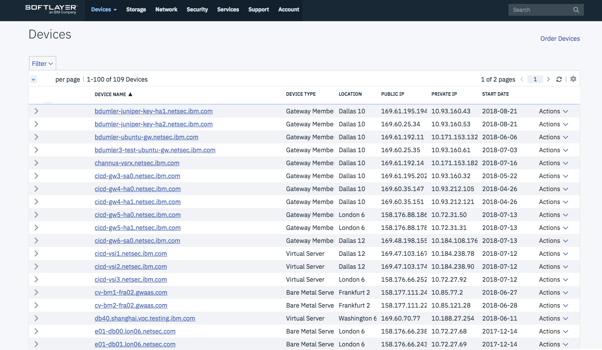
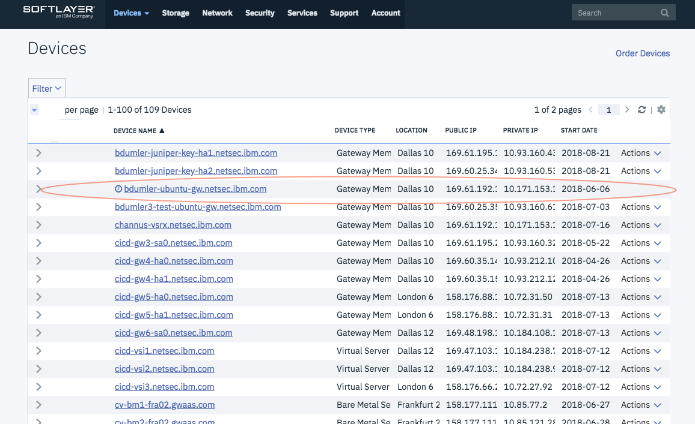

---

copyright:
  years: 2017
lastupdated: "2018-07-05"

---

{:shortdesc: .shortdesc}
{:new_window: target="_blank"}
{:codeblock: .codeblock}
{:pre: .pre}
{:screen: .screen}
{:tip: .tip}
{:download: .download}

# OS Reload
The OS Reload process is used to rebuild a server.  The process usually requires 30 mins to completd. The process will perform the following. 
* Reload the server's operating system.Server will be unusable during the reload.
* Reconfigure the vSRX on the server. 
* Server will be out of service during reload process. 

For HA Gateways, the server pair will need to be reconnected when process is complete.    

## To Perform OS Reload

1. Go to your Device List.  Select the server to perform OS Reload to go to the Device's detail page. 

2. On the device's page, click on the OS Reload Link in the System section to access the Server Configuration page. 

3. On the Server Confirguration page, you can configure and start the reload.  Following are configuration you can consider changing.  It is not recommended to change the Operating System from Juniper vSRX.  
When you are done modifying settings, click 'Reload Above Configuration' to continue

4. OS Reload is presented for you to confirm the New Configuration.  Review the settings.  Click 'Edit Settings' if changes are required.  Otherwise, click 'Next' to proceed.

5. OS Reload Confirmation is presented for you to agreed to the configuration you defined.  On the page, you will be required to agree to the terms of the Master Service Agreement.  To begin the OS Reload process, click on the 'Confirm OS Reload' button.  If you do not want to proceed with the reload, click Cancel. 

6. OS Reload process will begin.  You will be directed back to your Device List.  Notice, that the server you are Reloading will be highlighted by not 'Action' drop down and clock image. 
The server will no longer be usable until OS Reload and Network Gateway configuration is completed.

