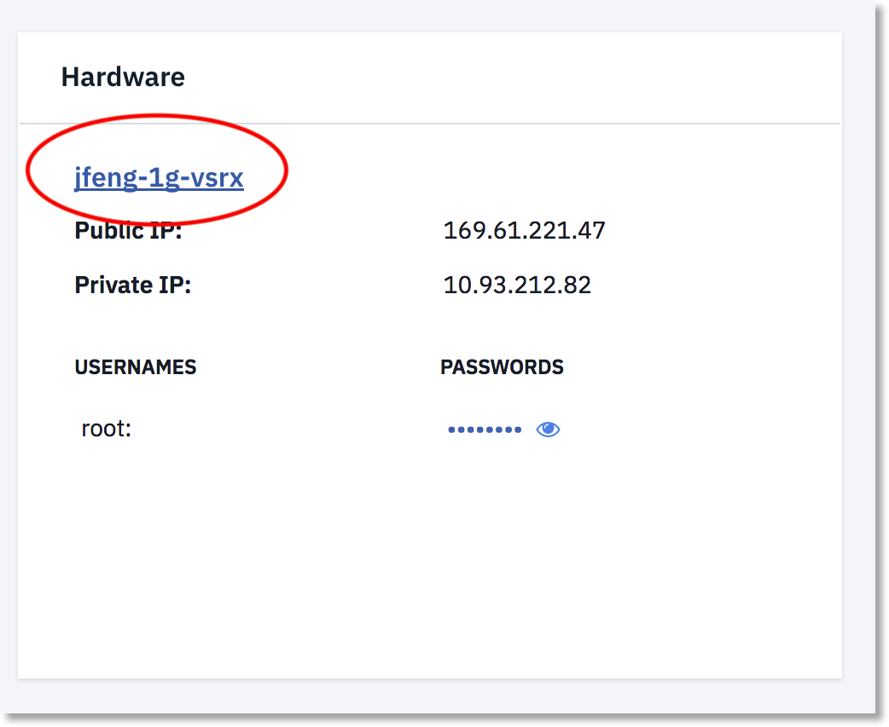
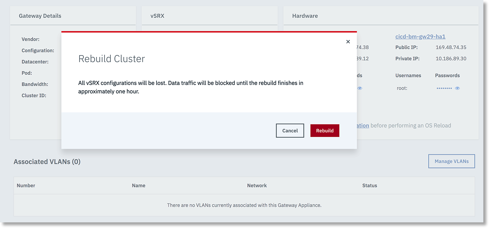

---

copyright:
  years: 2017
lastupdated: "2018-07-05"

---

{:shortdesc: .shortdesc}
{:new_window: target="_blank"}
{:codeblock: .codeblock}
{:pre: .pre}
{:screen: .screen}
{:tip: .tip}
{:download: .download}

# OS Reload
The OS Reload process is used to rebuild a gateway server. The process performs the following actions:

* Reload the server host's operating system
* Install KVM in the operating system
* Create a vSRX VM in the KVM
* Reconfigure the vSRX with the default configuration for IBM Cloud

The process usually requires 30 minutes to complete. Standalone Gateways will be out of service during this period. For High Availability (HA) Gateways, when you reload the OS on one of your servers, the vSRX will failover to another server in the cluster, and continue to process data traffic. Once the reload is complete, the server will rejoin the cluster.

**CAUTION:** Do not perform an OS reload on both servers of an HA Gateway at the same time. Doing so will destroy the vSRX cluster and cause the Gateway to be out of service. If the vSRX cluster is destroyed, you must use the `Rebuild Cluster` command to re-provision vSRX and recreate the HA cluster.

## Performing an OS reload
To reload the OS for a gateway server, perform the following procedure:

1. [Access the Gateway Appliances screen](access-gateway-appliances.html) in the Customer Portal, and navigate to the Gateway details page by selecting desired Gateway name.

2. Click the server name in the Hardware Panel.

3. On the device's page, click **OS Reload** in the Action drop down menu to access the Server Configuration page.

4. On the Server Configuration page, you can configure and start the reload. It is not recommended to change the Operating System from Juniper vSRX.  
When you are done modifying your settings, select **Reload Above Configuration** to continue.

5. The OS Reload details screen displays. Review the settings you have chosen, and click **Edit Settings** if changes are required. Otherwise, click **Next** to proceed.

6. On the OS Reload confirmation screen, agree to the terms of the Master Service Agreement, then begin the OS Reload process by clicking **Confirm OS Reload**. If you do not want to proceed with the reload, click **Cancel**.

## Rebuilding an HA vSRX cluster
To rebuild one of your HA vSRX clusters, perform the following procedure:

1. [Access the Gateway Appliances screen](access-gateway-appliances.html) in the Customer Portal, and navigate to the Gateway details page by selecting the desired HA Gateway name.

2. Click **Rebuild Cluster** in the vSRX Panel.

3. Carefully read the warning message. The operation to rebuild a cluster is destructive. If you wish to proceed, save your vSRX configuration before clicking `Rebuild` to start the process. 

