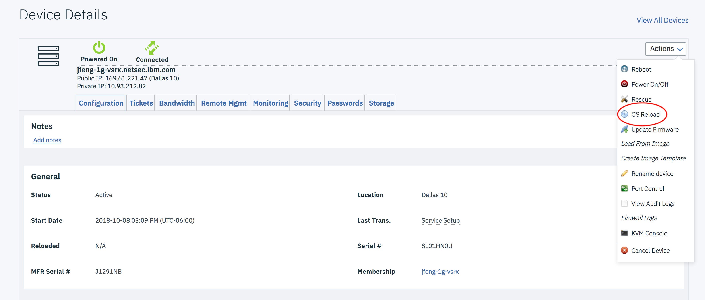
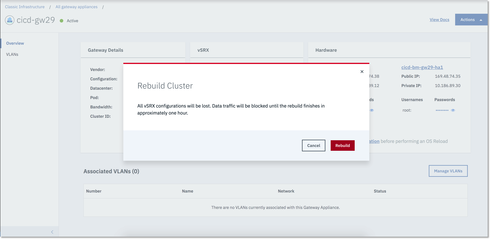

---

copyright:
  years: 2017
lastupdated: "2018-07-05"

---

{:shortdesc: .shortdesc}
{:new_window: target="_blank"}
{:codeblock: .codeblock}
{:pre: .pre}
{:screen: .screen}
{:tip: .tip}
{:download: .download}

# OS Reload
The OS Reload process is used to rebuild a gateway server. The process will perform the following:
* Reload the server host's operating system.
* Install KVM in the operating system.
* Create a vSRX VM in the KVM.
* Reconfigure the vSRX with default configuration for IBM Cloud.

The process usually requires 30 mins to complete. For standalone Gateway, it will be out of service during this period. For HA Gateway, when OS reloading on one of servers, the vSRX will failover to another server in the cluster, which will keep process data traffic. Once the reload is complete, the server will rejoin the cluster.

User should NOT perform OS reloading on both servers of a HA Gateway at same time, such operation will destroy vSRX cluster and cause the Gateway be out of service. If the vSRX cluster has been destroyed for some reason, user need use `Rebuild Cluster` to re-provision vSRX and recreate HA cluster.

## To Perform OS Reload

1. [Access the Gateway Appliances screen](access-gateway-appliances.html) in the Customer Portal. Navigate to Gateway detail page by selecting desired Gateway name.

2. Click the server name in Hardware Panel

3. On the device's page, click on the OS Reload in the Action drop down to access the Server Configuration page.

4. On the Server Configuration page, you can configure and start the reload. It is not recommended to change the Operating System from Juniper vSRX.  
When you are done modifying settings, click 'Reload Above Configuration' to continue

5. OS Reload is presented for you to confirm the New Configuration.  Review the settings.  Click 'Edit Settings' if changes are required.  Otherwise, click 'Next' to proceed.

6. OS Reload Confirmation is presented for you to agreed to the configuration you defined.  On the page, you will be required to agree to the terms of the Master Service Agreement.  To begin the OS Reload process, click on the 'Confirm OS Reload' button.  If you do not want to proceed with the reload, click Cancel.

## To Perform Rebuild Cluster

1. [Access the Gateway Appliances screen](access-gateway-appliances.html) in the Customer Portal. Navigate to Gateway detail page by selecting desired HA Gateway name.

2. Click the Rebuild Cluster in vSRX Panel

3. Rebuild Cluster operation is destructive. Read the warning message and save your vSRX configuration before click on `Rebuild` button to start the process. 

