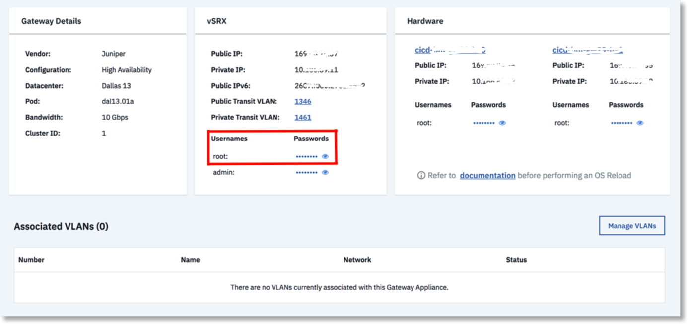

---

copyright:
  years: 2018
lastupdated: "2019-11-13"

keywords: reloading, os, upgrading, kvm, ha, standalone

subcollection: vsrx

---

{:shortdesc: .shortdesc}
{:new_window: target="_blank_"}
{:codeblock: .codeblock}
{:pre: .pre}
{:screen: .screen}
{:tip: .tip}
{:note: .note}
{:important: .important}
{:download: .download}
{:help: data-hd-content-type='help'}
{:support: data-reuse='support'}

# Reloading the OS
{: #reloading-the-os}
{: help}
{: support}

The OS reload process is used to rebuild a {{site.data.keyword.vsrx_full}} server.
{: shortdesc}

The process performs the following actions:

* Reload the server host's operating system (OS). This generates a new host OS password.
* Install KVM in the operating system
* Create a vSRX VM in the KVM
* Reconfigure the vSRX with the default configuration for IBM® Cloud

The process usually requires 1 hour 40 minutes to complete. Standalone Gateways are out of service during this period. For Juniper High Availability (HA) Gateways, when you reload the OS on one of your servers, the vSRX fails over to another server in the cluster, and continues to process data traffic. After the reload is complete, the server rejoins the cluster.

For a successful OS Reload on a vSRX, ensure the following:

* Do not modify the vSRX configuration during the execution of the OS Reload and Rebuild Cluster operations. Examples include automated software agents attempting to modify one or both vSRX nodes. Configurations changes can corrupt the OS Reload and Rebuild Cluster operations.

* The root password for the provisioned vSRX gateway must match the root password that is defined in the vSRX portal. The password in the portal was defined when the gateway was first provisioned, and might not match the current gateway password. If the password was changed after the initial provisioning, then use SSH to connect to the vSRX gateway and change the root password to match. After the passwords match, you can proceed with the OS Reload or Rebuild Cluster operation.

  

* The vSRX configuration must allow root SSH access to the vSRX Private IP, before the OS reload request. This is required to rejoin the cluster. After the OS reload is complete, the SSH access might be unavailable.

* **Do NOT** perform an OS reload on both servers of the Highly Available gateway at the same time.

Performing an OS reload on both servers of the HA gateway at the same time destroys the vSRX cluster and causes the gateway to be out of service. If the vSRX cluster is destroyed, you must use the **Rebuild Cluster** option to reprovision vSRX and re-create the HA cluster.
{: important}

* For the Rebuild Cluster option only, the host passwords must match the passwords in the vSRX portal. In addition, the host OS must enable root SSH access to the vSRX Private IP prior to doing a rebuild cluster.

## Performing an OS reload
{: #performing-an-os-reload}

To reload the OS for a gateway server, follow these steps:

To reload your OS, follow these steps:

1. From your browser, open [https://cloud.ibm.com ](https://cloud.ibm.com){:new_window} and log in to your account.
2. Select the Menu icon  from the upper left, then click **Classic Infrastructure**.
3. Choose **Network > Gateway Appliances**.
4. Click the server you want to reload.
5. Click the server name in the Hardware section.
4. Select **OS Reload** from the **Actions** menu on the upper right of the page.
5. In the OS Reload page, click **Edit** for the Category that requires an update. Select **Juniper** as the Vendor, and the OS version you want to reload.
6. Click the **Reload Above Configuration** button to proceed to the **Review** pop-up. Click **Cancel** to cancel the changes to the device and exit the page.
7. Verify that all details in the New Configuration section are correct. Click **Next** to advance to the Confirm pop-up.
8. Click the **Confirm OS Reload** button to confirm and initiate the OS Reload. Click **Cancel** to cancel the action.

## vSRX version mismatches
{: #vsrx-version-mismatches}

A {{site.data.keyword.vsrx_full}} cluster must have the same vSRX version on each node to fully support the High Availability feature. If a cluster has mismatched vSRX versions, then you must reload the OS of the node with the older version (by using the procedure in this topic) so that both nodes are at the same version level.

A version mismatch applies to both minor release mismatches and major release mismatches.
{: note}
