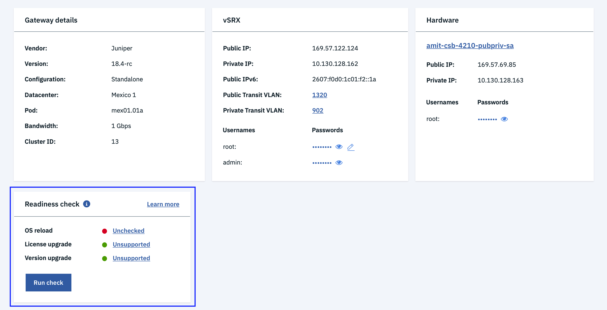

---

copyright:
  years: 2018
lastupdated: "2020-02-02"

keywords: correcting, readiness, errors

subcollection: vsrx

---

{:shortdesc: .shortdesc}
{:new_window: target="_blank_"}
{:codeblock: .codeblock}
{:pre: .pre}
{:screen: .screen}
{:tip: .tip}
{:note: .note}
{:important: .important}
{:download: .download}
{:help: data-hd-content-type='help'}
{:support: data-reuse='support'}

# Correcting readiness errors
{: #correcting-readiness-errors}

There are two categories of errors you may encounter when performing readiness checks:

  * Host (Ubuntu) SSH connectivity errors
  * Gateway (vSRX) SSH connectivity errors

If you encounter readiness check errors, refer to the following sections for tips on how to correct them.

## Host (Ubuntu) SSH connectivity errors
{: #correct-host_ssh_connectivity}

Many of the gateway actions require root SSH access to the private IP address for each host Ubuntu OS.

If a precheck readiness SSH connectivity check fails then the action can not proceed.

**QUESTION: We now seem to be saying "precheck" instead of readiness check. Which is correct?**

To validate connectivity, open an SSH session to the Ubuntu host's private IP using the root credentials listed in the **Hardware** section of the [Gateway Details](/docs/infrastructure/vsrx?topic=gateway-appliance-viewing-gateway-appliance-details) page. Ensure the SSH session can be established.

**NEEDED: Do they need more information on how to ensure the SSH session can be established?**

  

If the session cannot be established, check the potential following issues:

  * Is a firewall blocking SSH access to the private IP?
  * Is the root password listed on the Gateway Details page the correct password for the root user?
  If not, click the device link under the **Hardware** section and navigate to **Passwords**. Select **Actions > Edit credentials** and change the password to match the actual root password on the Ubuntu host.
- Is the root login disabled for the SSH server? Is the SSH server disabled or stopped?
- Is the root user account disabled on the Ubuntu host?

## Gateway (vSRX) SSH connectivity errors
{: #correct-gateway_ssh_connectivity}

As with the Ubuntu SSH connectivity errors, many of the gateway actions performed on the vSRX require root SSH access to the private IP address as well. If the precheck readiness SSH connectivity check fails then the action can not proceed. To validate connectivity open an SSH session to the vSRX private IP using the root credentials listed on the Gateway Details page. Ensure the SSH session can be established.

  

If the session cannot be established, check the potential following issues:

  * Is The vSRX firewall blocking SSH access to the private IP?
  * Is the root password listed on the Gateway details page above is the correct password for the root user?
  If not, click the **Edit** icon the root password and change the password to match the actual root password for the vSRX.
  **JACK TODO: This sentence seems to be missing some words. Is the Edit icon NEXT TO the root password? If not, what is meant here? Also, is the Edit icon the pencil icon?**
  * Is the root user account disabled on the Ubuntu host?
