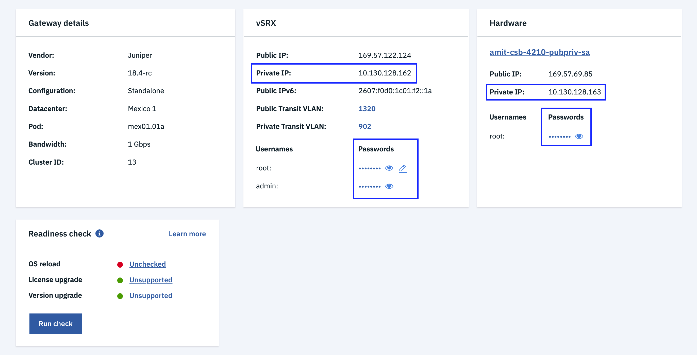

---

copyright:
  years: 2018
lastupdated: "2020-04-01"

keywords: correcting, readiness, errors

subcollection: vsrx

---

{:shortdesc: .shortdesc}
{:new_window: target="_blank_"}
{:codeblock: .codeblock}
{:pre: .pre}
{:screen: .screen}
{:tip: .tip}
{:note: .note}
{:important: .important}
{:download: .download}
{:help: data-hd-content-type='help'}
{:support: data-reuse='support'}

# Correcting readiness errors
{: #correcting-readiness-errors}

There are two categories of errors you may encounter when performing readiness checks:

  * Host (Ubuntu) SSH connectivity errors
  * Gateway (vSRX) SSH connectivity errors

Many of these errors result from the fact that the gateway actions being checked require root SSH access to the private IP address for either the Ubuntu (Host) OS or the vSRX (Gateway). If a precheck readiness SSH connectivity check fails, then the action can not proceed.

**QUESTION: In email ands slack, I've been seeing "precheck" used instead of readiness check. We also have precheck here. Which is correct? I assume Readiness check because it's in the UI, just making sure there isn't a term shift coming.**

To validate connectivity, open an SSH session to either the Ubuntu host's or vSRX's private IP using the root credentials listed in the **Hardware** section of the [Gateway Details](/docs/infrastructure/vsrx?topic=gateway-appliance-viewing-gateway-appliance-details) page. Ensure that the SSH session can be established.

**NEEDED: Do they need more information on how to ensure the SSH session can be established?**

  

If the session cannot be established, check the potential following issues.

For Host (Ubuntu) SSH connectivity errors:

  * Is a firewall blocking SSH access to the private IP?
  * Is the root password listed on the Gateway Details page the correct password for the root user?
  If not, click the device link under the **Hardware** section and navigate to **Passwords**. Select **Actions > Edit credentials** and change the password to match the actual root password on the Ubuntu host.
  * Is the root login disabled for the SSH server? Is the SSH server disabled or stopped?
  * Is the root user account disabled on the Ubuntu host?

For Gateway (vSRX) SSH connectivity errors:

  * Is The vSRX firewall blocking SSH access to the private IP?
  * Is the root password listed on the Gateway details page the correct password for the root user?
  If not, click the **Edit** icon  next to the root password and change the password to match the actual root password for the vSRX.
  * Is the root user account disabled on the Ubuntu host?
