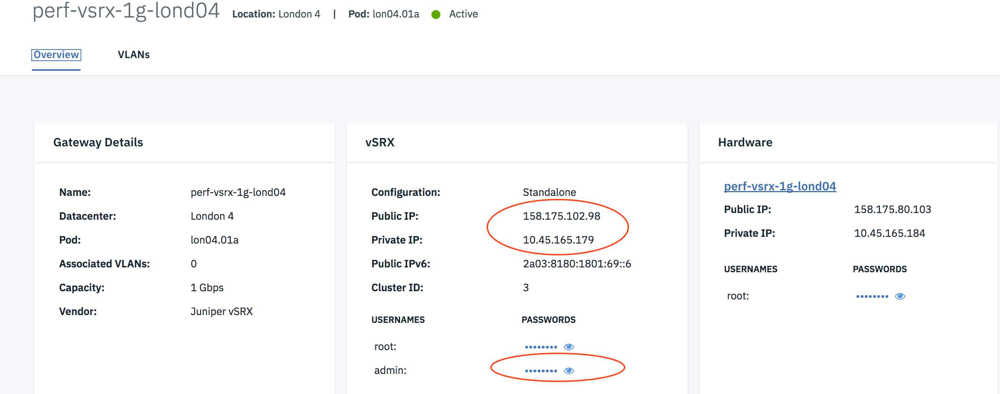

---

copyright:
  years: 2017
lastupdated: "2018-07-02"

---

{:shortdesc: .shortdesc}
{:new_window: target="_blank"}
{:codeblock: .codeblock}
{:pre: .pre}
{:screen: .screen}
{:tip: .tip}
{:download: .download}

# vSRX Basics
The IBM Cloud Juniper vSRX Firewall can be configured using a remote console session through SSH or by logging into the web GUI. By default, the web GUI is not available from the public internet. To enable the web GUI, log in through SSH first.

**NOTE:** Configuring the vSRX outside of its shell and interface may produce unexpected results and thus it is not recommended.

## Accessing the Device Using SSH
You can access the vSRX using SSH through a public/private IP:

1. Go to Gateway Appliance Details screen and get the Public gateway IP or Private Gateway IP.

	

2 Run the command `ssh customer-admin@<IP>`. The password will be the same as *root* password on the server.

To enable the web management GUI, you should run the following command from the CLI:

```
set system services web-management http interface fxp0.0 
```

##Creating system users
By default, the IBM Cloud Juniper vSRX Firewall is configured for root SSH access. Additional users can be added with their own set of priorities. For example:

```
set system login user ops class operator authentication encrypted-password <CYPHER>
```

Where `ops` is the username and `operator` is the class/permission level assigned to the user.

Customized classes can be also defined as opposed to pre-defined ones.

##Defining the vSRX hostname
To set or change the SRX hostname, you can use the following command:

```
set system host-name <hostname>
```

##Configuring DNS and NTP
To configure name server resolution and NTP, run the following commands:

```
set system name-server <DNS server>
set system ntp <NTP server>
```

##Changing the root password
To change the root password, run the following command:

```
set system root-authentication plain-text-password
```

This prompts you to input a new password, which is encrypted and stored in the configuration, and is not visible.