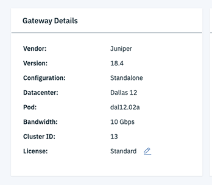
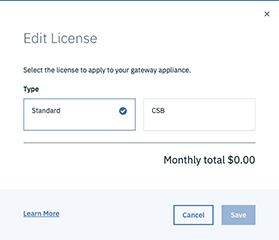

---

copyright:
  years: 2018
lastupdated: "2019-12-10"

keywords: basics, performing, accessing, ssh, device, gateway, configuration, mode, juniper, ui, dns, htp, password

subcollection: vsrx

---

{:shortdesc: .shortdesc}
{:new_window: target="_blank_"}
{:codeblock: .codeblock}
{:pre: .pre}
{:screen: .screen}
{:tip: .tip}
{:download: .download}
{:note: .note}
{:important: .important}

# Performing vSRX basics
{: #performing-ibm-cloud-juniper-vsrx-basics}

You can configure and maintain your {{site.data.keyword.vsrx_full}} in various ways, either through a remote console session through SSH or by logging in to the Juniper web management GUI.
{: shortdesc}

Configuring the vSRX outside of its shell and interface can produce unexpected results and is not recommended.
{: note}

## Accessing the device by using SSH
{: #accessing-the-device-using-ssh}

You can access the vSRX by using SSH through a public IP address, or through a private IP address if you're on IBM Cloud VPN:

1. Go to Gateway Appliance Details page and get the Public gateway IP or Private Gateway IP.

  

2. Click the "eye" icon to reveal the admin user's password.

3. Run the command `ssh admin@<gateway-ip>`, then enter the admin user's password.

If you do not see the "eye" icon, you might not have permission to view the password. Check your access permissions with the account owner.
{: note}

## Accessing configuration mode
{: accessing-the-configuration-mode}

You can enter configuration mode after a shell is open to the vSRX, by running the `config` command. You can do several things in this mode by using the following commands:

* `show` - View configurations  
* `show | compare` - View staged changes
* `set` - Stage changes
* `commit check` - Verify the syntax of the configuration

If you are happy with your changes, you can commit them to the active configuration by running the commands `commit` and then `save`.  

To leave configuration mode, run the command `exit`.

## Accessing the device by using the Juniper web management UI
{: #accessing-the-device-using-the-juniper-web-management-ui}

The Juniper web management GUI is configured by default, with vSRX generated self-signed certificate. Only HTTPS is enabled on port 8443. You can access it at `https://gateway-ip:8443`.


## Creating system users
{: #creating-system-users}

By default, the {{site.data.keyword.vsrx_full}} is configured with SSH access for the username `admin`. Additional users can be added with their own set of priorities. For example,:

```
set system login user ops class operator authentication encrypted-password <CYPHER>
```

In this example, `ops` is the username and `operator` is the class/permission level that is assigned to the user.

Customized classes can be also defined as opposed to pre-defined ones.

## Defining the vSRX hostname
{: #defining-the-vsrx-hostname}

You can set or change the vSRX hostname using the following command:

```
set system host-name <hostname>
```

## Configuring DNS and NTP
{: #configuring-dns-and-ntp}

To configure name server resolution and NTP, run the following commands:

```
set system name-server <DNS server>
set system ntp <NTP server>
```

## Changing the root password
{: #changing-the-root-password}

You can change the root password by running the following command:

```
set system root-authentication plain-text-password
```

This prompts you to input a new password, which is encrypted and stored in the configuration, and is not visible.

## Viewing and changing vSRX licenses
{: #vsrx-licenses}

Currently, only {{site.data.keyword.vsrx_full}} 10G Standalone configurations can choose between the following license options. Full support for among all the various vSRX configurations, including 1G and High Availability, will be introduced soon.
{: important}

The vSRX has two available licenses:

* Standard
* Content Security Bundle (CSB)

For information on the features offered with these licenses, refer to [Choosing a vSRX license](/docs/vsrx?topic=vsrx-getting-started#choosing-license).

To view your current license, follow these steps:

1. From your browser, open [https://cloud.ibm.com ](https://cloud.ibm.com){:new_window} and log in to your account.
2. Select the Menu icon    from the upper left, then click **Classic Infrastructure**.
3. Choose **Network > Gateway Appliances**.
4. Click the Gateway Appliance Name for the network gateway to access the Gateway Appliance Details page.


To change your current license, perform the steps above, then:

1. Click the Pencil icon   next to your current license to edit it.

  

2. Select your new license type, then click **Save**.

  
