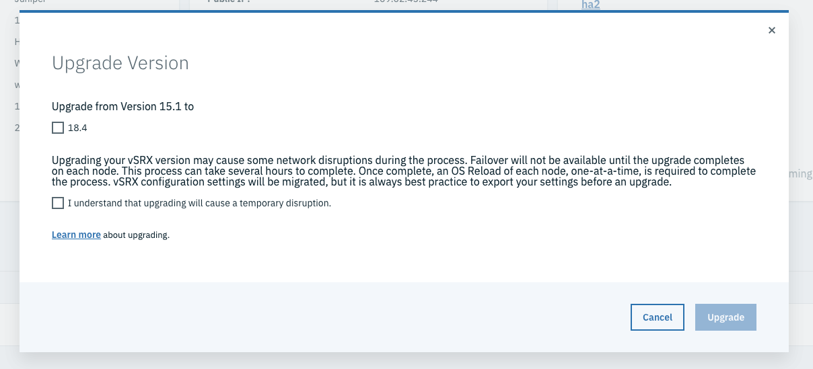

---

copyright:
  years: 2019
lastupdated: "2019-6-14"

keywords: reloading, os, upgrading, kvm, ha, standalone

subcollection: vsrx

---

{:shortdesc: .shortdesc}
{:new_window: target="_blank"}
{:codeblock: .codeblock}
{:pre: .pre}
{:screen: .screen}
{:tip: .tip}
{:note: .note}
{:important: .important}
{:download: .download}

# Upgrading the vSRX
{: #upgrading-the-vSRX}

The upgrade process is used to migrate the Junos OS for vSRX software to a newer release. The process usually requires several hours to complete depending on whether it's a Standalone or High Availability(HA) gateway appliance. For Standalone Gateways, the vSRX will be out of service during the upgrade process. For HA Gateways, when doing the upgrade, the vSRX will failover to another server in the cluster, and continue to process data traffic. Once the upgrade is complete, the server will rejoin the cluster.  

## Considerations
{: #considerations}

* The Standalone upgrade requires one step: OS Reload.

For Standalone, the previous configuration is not restored, so an export/import is strongly recommended. Reference [Importing and Exporting the vSRX Configuration](docs/infrastructure/vsrx?topic=vsrx-importing-and-exporting-the-vsrx-configuration) for more details.
{: important}

* The HA upgrade requires two steps: vSRX Upgrade and then OS Reload. It is strongly recommended that customers validate the vSRX configuration is correct at each step.
* When requesting OS Reload, make sure to change the default OS and select the newer version.

* For successful reload on an HA vSRX, the root password for the provisioned vSRX Gateway must match the root password defined in the vSRX portal, and root SSH login needs to be enabled. The password in the portal was defined when the Gateway was first provisioned, and may not match the current Gateway password. If the password was changed after the initial provisioning, then use SSH to connect to the vSRX Gateway and change the root password to match.

Performing an OS reload on both servers of the HA gateway at the same time will destroy the vSRX cluster and cause the gateway to be out of service. If the vSRX cluster is destroyed, you must use the Rebuild Cluster option to re-provision vSRX and recreate the HA cluster. Ensure the OS Reload of the first member is complete before requesting an OS Reload of the second member.
{: important}

* Before doing an upgrade, run `show chassis cluster status` to make sure that a single node is configured as primary (with higher priority) for both redundancy groups, and that node at run time is serving as the primary for both RGs. If RGs' primary are not on the same node, run `request chassis cluster failover redundancy-group <RG number> node <node number>` and then `request chassis cluster failover reset redundancy-group <RG number>` to manually make RGs fall on the same node.
* It is good practice to backup (export) your vSRX configuration settings before starting the upgrade. Details can be found [here](/docs/infrastructure/vsrx?topic=vsrx-importing-and-exporting-the-vsrx-configuration).

The upgrade process varies depending upon the vSRX Gateway Appliance configuration. Reference the vSRX appliance configurations to determine which upgrade steps are needed for you vSRX:

| vSRX Appliance              | Upgrade Method                                                      |
| :---:                       |                                                               :---: |
| Standalone 1G/10G        | Export vSRX Configuration OS Reload Import vSRX Configuration |
| High Availability 1G/10G | Export vSRX Configuration vSRX Upgrade OS Reload              |

For available Juniper vSRX versions and version specific upgrade considerations, please visit [here](/docs/infrastructure/vsrx?topic=vsrx-ibm-cloud-juniper-vsrx-release-notes).

## Performing a vSRX Upgrade (Standalone)
{: #performing-a-vsrx-upgrade-sa}

To do a vSRX upgrade, reference [this page](docs/infrastructure/vsrx?topic=vsrx-reloading-the-os) to reload the OS. Since the default OS is the same OS, make sure to **change the default OS** and select the newer one.

For Standalone, the previous configuration is not restored, so an export/import is strongly recommended!
{: important}

## Performing a vSRX Upgrade (High Availability)
{: #performing-a-vsrx-upgrade-ha}

To do a vSRX upgrade, perform the following procedure:

1. [Access the Gateway Appliances screen](/docs/infrastructure/vsrx?topic=vsrx-viewing-all-your-gateway-appliances) in the Customer Portal, and navigate to the Gateway details page by selecting desired Gateway name.

  

2. Click the server name in the Hardware Panel.

  
  
3. On the device’s page, click **Upgrade Version** in the Action drop down menu to access the Upgrade Version page.

  

4. On the Upgrade Version page, you can select the newer version and start the vSRX Upgrade.

  

5. If the upgrade is successful the Gateway will move to "Upgrade Active". It is recommended you validate the vSRX configuration. The **Rollback** Action is available in the drop down menu. Rollback will revert the vSRX to the previous version and preserve any configuration's.

Once OS Reload is started in step 6 the Rollback Action will no longer be available.
{: important}

  

6. OS Reload one node at a time to update the Host OS. OS Reload Steps can be found [here](/docs/infrastructure/vsrx?topic=vsrx-reloading-the-os). Since the default OS is the same OS, make sure to **change the default OS** and select the newer one.